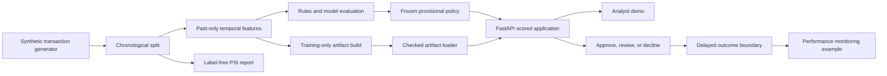

# System architecture

This repository separates offline model work, online decisioning, and
post-event monitoring. The split is intentional. Labels belong in evaluation
and delayed-outcome monitoring, never in a scoring request.

## Offline data and model path

The data generator produces a deterministic synthetic sample. The splitter
keeps equal timestamps together and creates strict train, validation, and test
periods. Temporal features use only events before the current timestamp. Rows
at the same timestamp cannot see one another.

Rules, Logistic Regression, and XGBoost share this chronological protocol.
XGBoost remains an engineering-only provisional score source because its
validation advantage is small and the held-out ranking evidence is mixed. The
repository records that decision instead of promoting the model based on one
favorable metric.

The artifact command fits the frozen XGBoost pipeline on training only. Its
metadata binds the joblib file to the training sources, ordered feature
contract, model configuration, score-source label, and artifact checksum. The
checksum detects accidental changes. It does not make pickle safe for untrusted
input.

## Online scoring and decision path

The scored FastAPI factory loads the artifact, selected policy, and reason
configuration once during startup. A request contains one transaction and
precomputed customer-history fields. It contains no fraud labels and cannot
change the policy or supply its own risk score.

The scorer maps the request to the same ordered feature contract used offline.
The decision layer converts the resulting score to `approve`, `review`, or
`decline`, then assigns stable reasons from decision-time fields. The response
includes the policy and artifact identity so a result can be traced to the
runtime contract that produced it.

The application does not compute live temporal state, persist transactions, or
manage a review queue. Those are explicit production gaps, not hidden features.

## Monitoring boundaries

`fraud-monitor-input-drift` compares train with the later validation split. It
accepts label-free model inputs, derives fixed quantile bins from train, and
calculates PSI with a separate missing-value bin. It never scores the model or
reads the fraud-label values.

`fraud-monitor-performance-example` demonstrates the later boundary where
outcomes have matured. Pending labels count toward coverage but do not enter
fraud recall, false-decline rate, fraud amount capture, or Brier score. Its
checked-in rows are illustrative, so the report is a contract example rather
than a claim about the provisional model.

## Runtime and delivery

The local image runs the scored factory as UID and GID `10001`. The model,
metadata, training transactions, and training temporal features remain outside
the image as four read-only mounts. The health check calls the scored
application directly.

The CI workflow tests Python 3.11, 3.12, and 3.13, checks formatting and lint,
reproduces the data-to-demo path, regenerates both monitoring reports, runs the
real scored-app smoke check, and builds the container image. Until the workflow
is committed and pushed, only its local syntax and corresponding commands can
be verified.

## Trust and interpretation limits

- The data, costs, and delayed-outcome example are synthetic.
- The current policy has equal review and decline thresholds, so its selected
  validation review band is empty.
- Reason codes describe configured conditions. They are not SHAP values or
  causal explanations.
- Local latency excludes network infrastructure, concurrency, and live feature
  calculation.
- The container check covers one Apple-silicon host and a Linux arm64 guest.
- No result in this repository establishes production readiness, fairness,
  regulatory compliance, or real financial impact.
